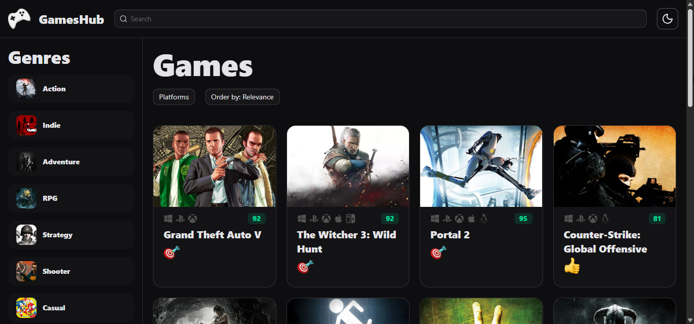
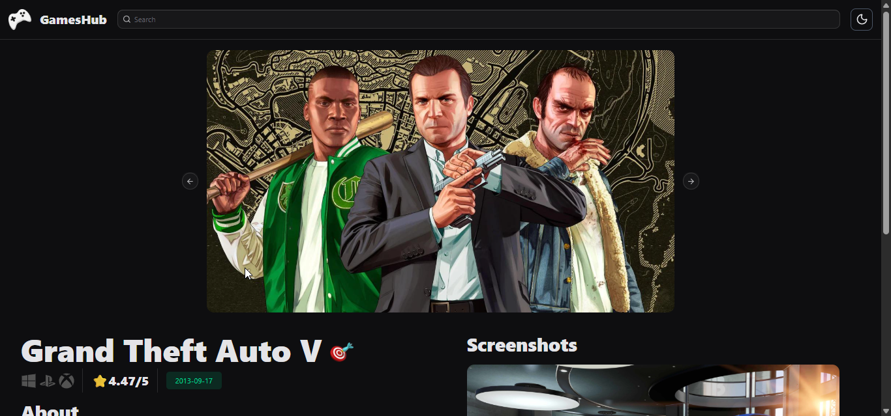
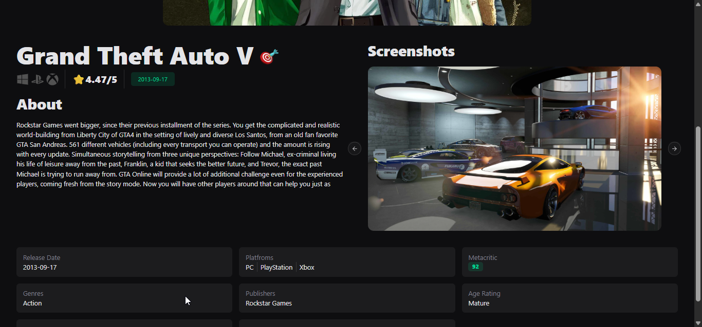

# 🎮 Games Hub – Game Discovery Platform

A modern game discovery web app built using the RAWG API.  
Browse, search, and explore thousands of video games with filters, trailers, and detailed info.

Live Demo 👉 https://games-hub-project.vercel.app/

---

## 🚀 Features

- 🔍 Search games by name
- 🎯 Filter by genre, platform, and rating
- 📊 Sort by popularity, release date, and more
- ♾️ Infinite scroll / pagination
- 📄 Detailed game pages
- 🎬 Trailers & screenshots
- ⚡ Fast loading with caching
- 📱 Responsive design (mobile-friendly)

---

## 🛠 Tech Stack

- **Frontend:** React + TypeScript + Vite
- **Styling:** Tailwind CSS
- **State Management:** Zustand
- **Server State:** React Query (TanStack Query)
- **API:** RAWG Video Games Database API
- **Deployment:** Vercel

---

## 📸 Screenshots


Examples:







---

## 📦 Installation & Setup

Clone the repository:

```bash
git clone https://github.com/nvsirkhvn404/games-hub-project.git
cd games-hub-project
Install dependencies (using Bun or npm):

bun install
# or
npm install
Create a .env file and add your RAWG API key:

VITE_RAWG_API_KEY=your_api_key_here
Start the development server:

bun run dev
# or
npm run dev 
```
---

## 📚 What I Learned While building this project:

How to work with a real-world public API

Managing server state using React Query

Global state management with Zustand

Building scalable component structures

Handling loading, error, and empty states

Deploying projects using Vercel

Writing cleaner and more maintainable React code

---

### 🤝 Contributing
Contributions, suggestions, and feedback are welcome!

If you’d like to improve this project:

Fork the repo

Create a new branch

Make your changes

Submit a pull request

📄 License
This project is open-source and available under the MIT License.

---

### 🙌 Acknowledgements
RAWG API for providing game data

React & Vite communities

Open-source contributors

---

💬 Feedback
If you have any feedback or ideas, feel free to open an issue or reach out.

Thanks for checking out my project! 😊